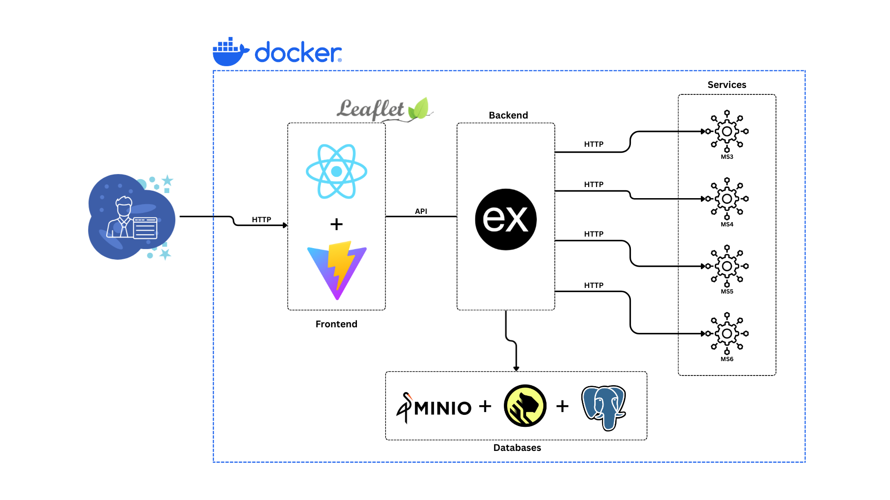
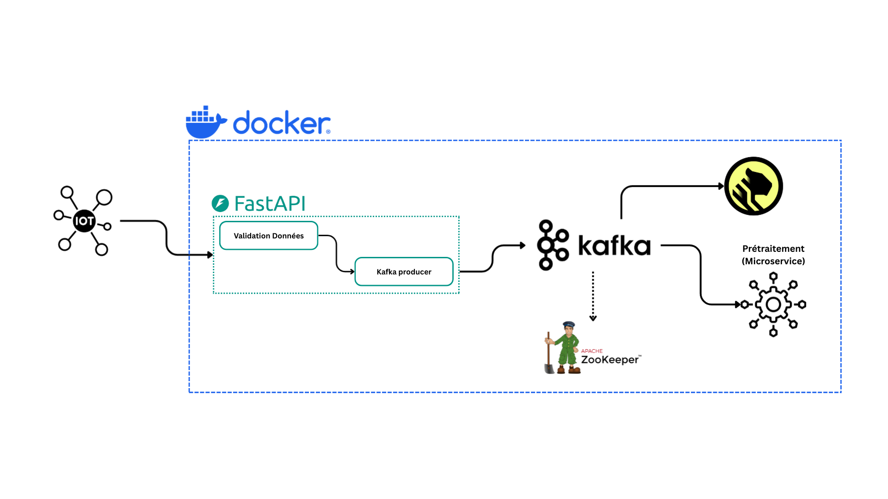
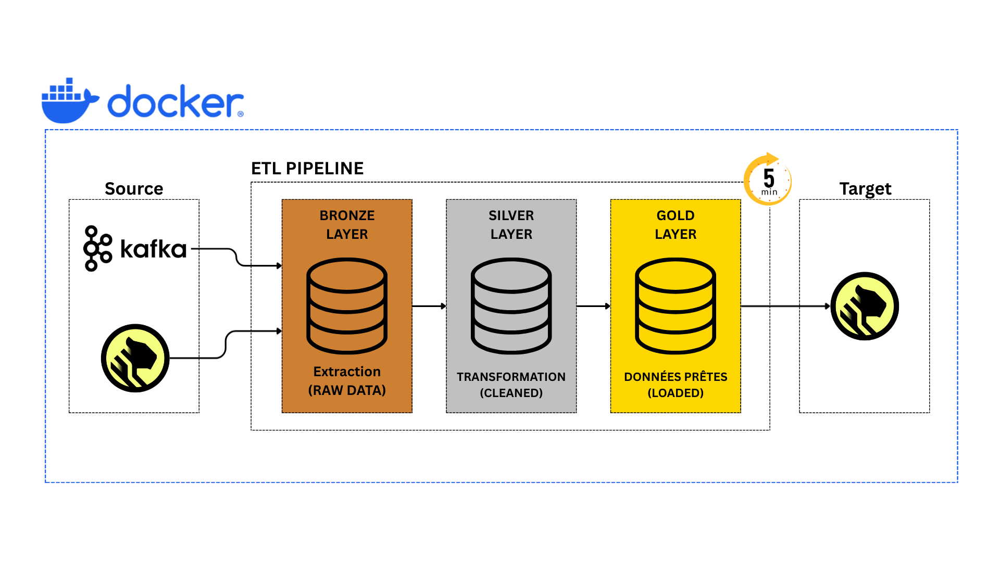
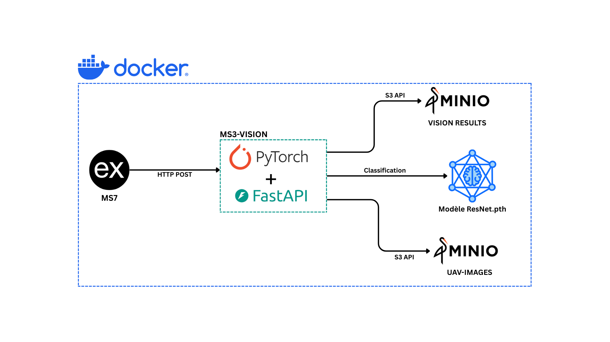
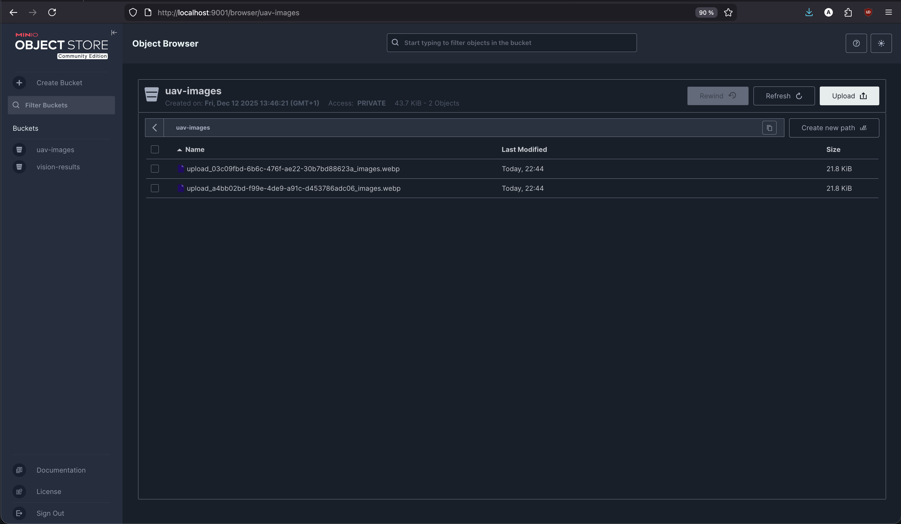
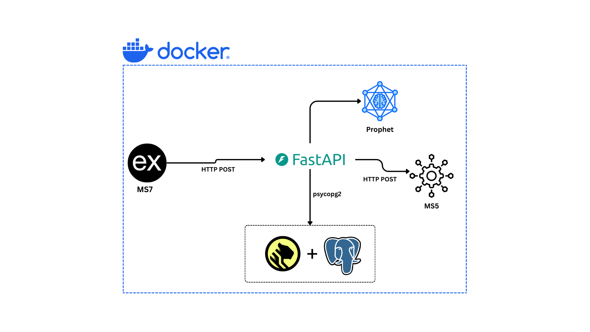
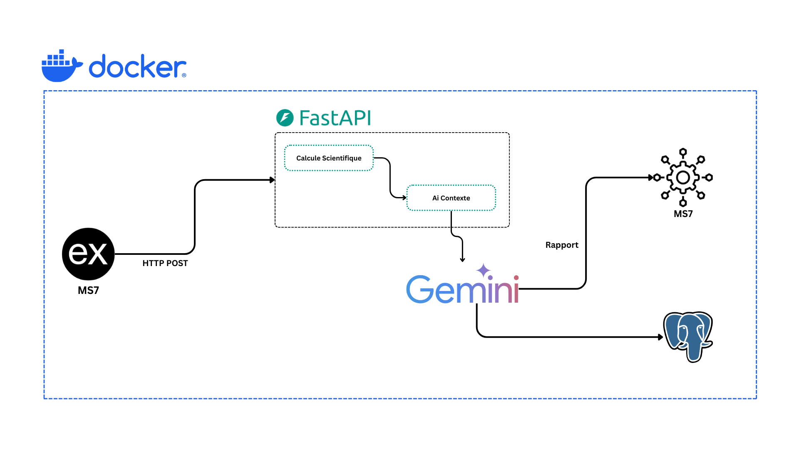
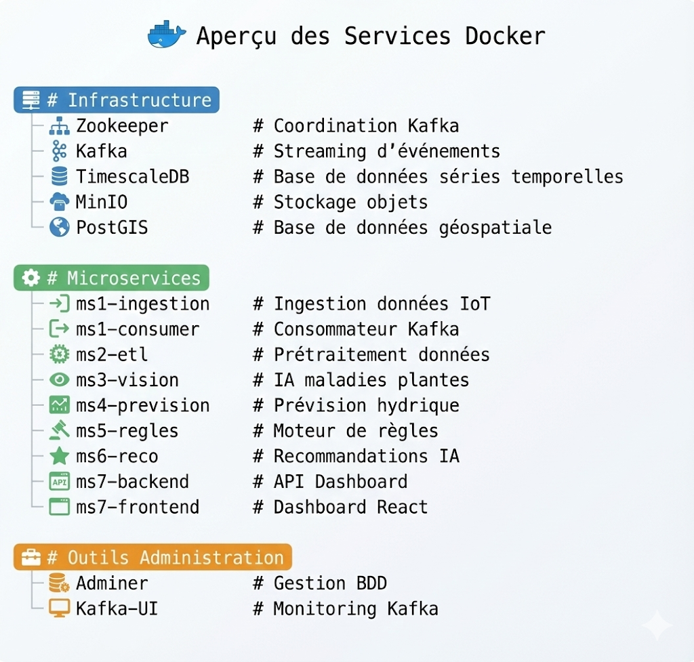
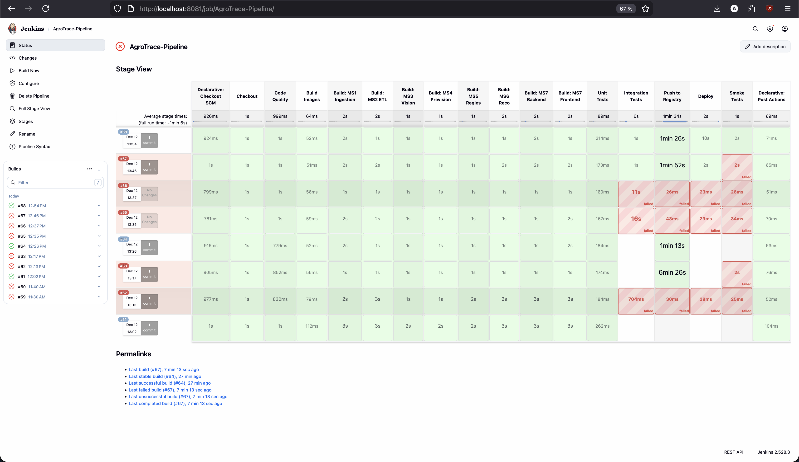
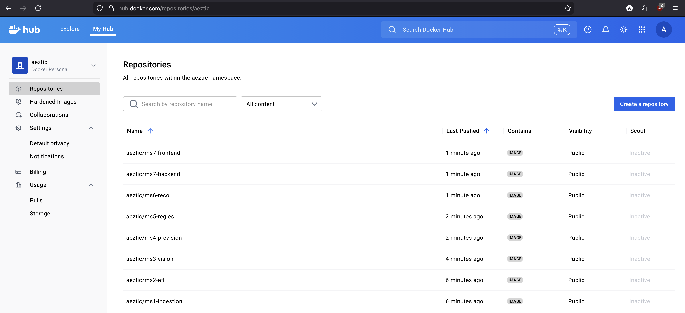

<div align="center">

# 🌱 AgroTrace - Plateforme d'Agriculture de Précision

### *Système Intelligent de Traçabilité Agricole Propulsé par l'IoT et l'IA*

[](https://www.python.org/)
[](https://fastapi.tiangolo.com/)
[](https://nodejs.org/)
[](https://reactjs.org/)
[](https://kafka.apache.org/)
[](https://www.docker.com/)
[](https://www.postgresql.org/)
[](https://pytorch.org/)

---

**Transformez Votre Agriculture avec l'Intelligence Artificielle**

*Des Capteurs IoT aux Recommandations Actionnables en Temps Réel*

[🚀 Démarrage Rapide](#-démarrage-rapide) • [📖 Architecture](#-architecture-globale) • [🎯 Fonctionnalités](#-fonctionnalités-clés) • [🛠️ Technologies](#-stack-technologique)

</div>

---

## 🌍 Présentation

**AgroTrace** est une plateforme **basée sur une architecture microservices** pour l'agriculture de précision qui combine **données de capteurs IoT, vision par ordinateur, prédictions par apprentissage automatique et expertise agronomique** pour aider les agriculteurs à optimiser l'irrigation, détecter précocement les maladies des plantes et prendre des décisions basées sur les données.

La plateforme traite les données des capteurs en temps réel via une architecture événementielle, applique des modèles d'IA/ML pour les prédictions et délivre des recommandations actionnables à travers un tableau de bord SIG interactif.

### 🎯 Le Problème Que Nous Résolvons

| Défi | Notre Solution |
|------|----------------|
| 💧 Gaspillage d'eau et irrigation inefficace | Recommandations d'irrigation propulsées par l'IA basées sur les prédictions |
| 🌡️ Détection tardive du stress des cultures | Surveillance en temps réel des capteurs avec alertes instantanées |
| 🦠 Identification tardive des maladies | Analyse par vision par ordinateur des images de drones/UAV |
| 📊 Données agricoles fragmentées | Tableau de bord SIG unifié consolidant toutes les informations |
| ⏰ Agriculture réactive plutôt que proactive | Modèles prédictifs prévoyant jusqu'à 7 jours à l'avance |

---

## 🏗️ Architecture Globale

<div align="center">



*Vue d'ensemble de l'architecture microservices AgroTrace*

</div>

L'architecture se compose de **7 microservices** interconnectés, orchestrés via **Docker Compose** et communiquant à travers **Apache Kafka** pour le streaming d'événements et des **APIs REST** pour les requêtes synchrones.

---

## ✨ Fonctionnalités Clés

<table>
<tr>
<td width="50%">

### 📡 Ingestion IoT Temps Réel
- Collecte haute performance des données capteurs
- Streaming d'événements via Apache Kafka
- Latence d'ingestion inférieure à 100ms
- Support de 5+ types de capteurs

</td>
<td width="50%">

### 🧹 Traitement Intelligent des Données
- Pipeline ETL automatisé (Bronze-Silver-Gold)
- Validation des données et détection d'anomalies
- Interpolation des valeurs manquantes
- Stockage TimescaleDB pour séries temporelles

</td>
</tr>
<tr>
<td width="50%">

### 🤖 Prédictions Propulsées par l'IA
- Modèles de prévision **Prophet** et **LSTM**
- Prédiction du stress hydrique jusqu'à 7 jours
- Intervalles de confiance inclus
- Mélange de modèles pour une précision optimale

</td>
<td width="50%">

### 🌿 Détection de Maladies des Plantes
- Deep Learning avec PyTorch (U-Net)
- Analyse d'images UAV/Drone
- Masques de segmentation des maladies
- Stockage d'images via MinIO

</td>
</tr>
<tr>
<td width="50%">

### 📋 Moteur de Règles Expert
- 8 règles agronomiques pour l'aide à la décision
- Recommandations basées sur la priorité
- Prise en compte du type de sol et stade de croissance
- Framework de règles extensible

</td>
<td width="50%">

### 🧠 Assistant IA pour l'Irrigation
- Approche hybride scientifique + LLM
- Intégration Google Gemini/OpenAI
- Conseils agronomiques personnalisés
- Score de confiance

</td>
</tr>
</table>

### 🗺️ Tableau de Bord SIG Interactif

- Visualisation géospatiale **propulsée par PostGIS**
- Surveillance du stress des parcelles en temps réel avec cartes colorées
- Superposition des alertes maladies et recommandations d'irrigation
- **Export PDF** pour les rapports de terrain
- Interface moderne React + Leaflet

---

## 📦 Les 7 Microservices

### MS1 - Ingestion Capteurs 📡

**Rôle** : Point d'entrée des données IoT. Reçoit les mesures des capteurs via API REST, valide les données et les publie vers Apache Kafka pour un traitement asynchrone.

<div align="center">



</div>

| Caractéristique | Détail |
|-----------------|--------|
| **Port** | 8001 |
| **Technologies** | FastAPI, Confluent Kafka, Pydantic |
| **Entrée** | Données JSON des capteurs IoT |
| **Sortie** | Messages Kafka sur le topic `capteur_data` |

---

### MS2 - Prétraitement ETL 🧹

**Rôle** : Pipeline de nettoyage des données brutes selon l'architecture Bronze-Silver-Gold. Exécute automatiquement toutes les 5 minutes pour transformer les données brutes en données propres et exploitables.

<div align="center">



</div>

| Caractéristique | Détail |
|-----------------|--------|
| **Type** | Worker en arrière-plan |
| **Technologies** | Pandas, NumPy, APScheduler, Psycopg2 |
| **Stratégies** | Interpolation linéaire, clipping, validation |
| **Tables** | `raw_capteur_data` → `clean_sensor_data` |

---

### MS3 - VisionPlante 🌿

**Rôle** : Analyse d'images de drones/UAV pour détecter les maladies des plantes en utilisant un réseau de neurones U-Net. Génère des masques de segmentation et des scores de sévérité.

<div align="center">



</div>

| Caractéristique | Détail |
|-----------------|--------|
| **Port** | 8002 |
| **Technologies** | PyTorch, U-Net, MinIO |
| **Modèle IA** | Segmentation sémantique des maladies |
| **Stockage** | MinIO (compatible S3) |

<div align="center">



*Interface MinIO pour le stockage des images d'analyse des maladies des plantes*

</div>

---

### MS4 - PrévisionEau 📈

**Rôle** : Prédiction du stress hydrique et des besoins en irrigation sur 1 à 7 jours. Utilise des modèles d'IA avancés (Prophet et LSTM) pour générer des prévisions fiables avec intervalles de confiance.

<div align="center">



</div>

| Caractéristique | Détail |
|-----------------|--------|
| **Port** | 8003 |
| **Technologies** | Prophet (Meta), PyTorch LSTM, Scikit-learn |
| **Modèles** | Prophet, LSTM, Blending |
| **Horizon** | 1 à 7 jours de prévision |

---

### MS5 - RèglesAgro 📋

**Rôle** : Moteur de règles expert qui traduit les données techniques en recommandations agronomiques concrètes. Évalue 8 règles basées sur l'expertise agricole pour générer des conseils priorisés.

| Caractéristique | Détail |
|-----------------|--------|
| **Port** | 8004 |
| **Technologies** | FastAPI, Pattern Rule Engine |
| **Règles** | 8 règles agronomiques (irrigation, pH, température, etc.) |
| **Priorités** | CRITICAL, HIGH, MEDIUM, LOW |

---

### MS6 - RecoIrrigation 💧

**Rôle** : Calcul intelligent de plans d'irrigation combinant approche scientifique (évapotranspiration) et analyse contextuelle par LLM (Gemini) pour des recommandations personnalisées.

<div align="center">



</div>

| Caractéristique | Détail |
|-----------------|--------|
| **Port** | 8005 |
| **Technologies** | FastAPI, Google Gemini |
| **Approche** | Hybride scientifique + IA générative |
| **Sortie** | Plan d'irrigation avec justification |

---

### MS7 - DashboardSIG 🗺️

**Rôle** : Interface utilisateur finale. Tableau de bord SIG interactif permettant de visualiser les parcelles, alertes, recommandations et statistiques sur une carte géospatiale avec export PDF.

| Caractéristique | Détail |
|-----------------|--------|
| **Port Frontend** | 8080 |
| **Port Backend** | 8006 |
| **Technologies** | React, Vite, Node.js, Express, PostGIS, Leaflet |
| **Fonctionnalités** | Carte interactive, alertes, export PDF |

---

## 🔄 Démonstration : Messages Kafka

La capture d'écran ci-dessous montre les messages transitant par Apache Kafka sur le topic `capteur_data` :

<div align="center">


*Messages de capteurs IoT dans le topic Kafka `capteur_data`*

</div>

**Observations** :
- ✅ Messages consommés avec succès
- ✅ Structure JSON validée (capteur_id, timestamp, mesures)
- ✅ Support multi-capteurs (PH001, SOIL001, HUM001, LIGHT001, TEMP001)
- ✅ Horodatage précis et cohérent

---

## 🛠️ Stack Technologique

<table>
<tr>
<th>Catégorie</th>
<th>Technologies</th>
</tr>
<tr>
<td><strong>🐍 APIs Backend</strong></td>
<td>FastAPI, Uvicorn, Pydantic, Express.js</td>
</tr>
<tr>
<td><strong>⚛️ Frontend</strong></td>
<td>React 18, Vite, Leaflet, Axios, jsPDF, Lucide Icons</td>
</tr>
<tr>
<td><strong>🤖 IA/ML</strong></td>
<td>PyTorch, Prophet (Meta), Réseaux LSTM, Scikit-learn, Architecture U-Net</td>
</tr>
<tr>
<td><strong>🧠 Intégration LLM</strong></td>
<td>Google Gemini 1.5 Flash</td>
</tr>
<tr>
<td><strong>📨 Messagerie</strong></td>
<td>Apache Kafka, Zookeeper, Confluent Platform</td>
</tr>
<tr>
<td><strong>🗄️ Bases de Données</strong></td>
<td>TimescaleDB (séries temporelles), PostgreSQL + PostGIS (géospatial), MinIO (stockage objets)</td>
</tr>
<tr>
<td><strong>🐳 Infrastructure</strong></td>
<td>Docker, Docker Compose, Nginx, Health Checks</td>
</tr>
<tr>
<td><strong>📊 Traitement de Données</strong></td>
<td>Pandas, NumPy, APScheduler</td>
</tr>
</table>

---

## 🚀 Démarrage Rapide

### Prérequis

- **Docker** & **Docker Compose** (dernière version)
- **Python 3.9+** (pour le développement local)
- **Node.js 20+** (pour le développement frontend)
- **Git**

### 1. Cloner le Dépôt

```bash
git clone https://github.com/Rzn-Mohamed/Agrotrace.git
cd Agrotrace
```

### 2. Configurer l'Environnement

```bash
cp .env.example .env
# Éditez .env avec votre configuration (clés API, mots de passe, etc.)
```

### 3. Lancer Tous les Services

```bash
docker-compose up -d --build
```

### 4. Vérifier le Déploiement

```bash
docker-compose ps
```

### 5. Accéder à la Plateforme

| Service | URL | Description |
|---------|-----|-------------|
| 🗺️ **Dashboard SIG** | http://localhost:8080 | Interface utilisateur principale |
| 📡 **API Ingestion** | http://localhost:8001/docs | API données capteurs |
| 🌿 **API Vision** | http://localhost:8002/docs | Détection maladies plantes |
| 📈 **API Prévisions** | http://localhost:8003/docs | Prédictions hydriques |
| 📋 **API Règles** | http://localhost:8004/docs | Règles agronomiques |
| 💧 **API Irrigation** | http://localhost:8005/docs | Recommandations |
| 📊 **Kafka UI** | http://localhost:8889 | Monitoring des topics Kafka |
| 🗄️ **Adminer** | http://localhost:8888 | Gestion base de données |

---

## 📡 Capteurs IoT Supportés

| ID Capteur | Mesure | Unité | Application |
|------------|--------|-------|-------------|
| `TEMP001` | Température | °C | Surveillance climatique |
| `HUM001` | Humidité de l'air | % | Conditions atmosphériques |
| `SOIL001` | Humidité du sol | % | Irrigation intelligente |
| `PH001` | Niveau de pH | 0-14 | Qualité du sol |
| `LIGHT001` | Luminosité | lux | Optimisation croissance |

---

## 🧠 Modèles IA/ML

### 1. Prévision du Stress Hydrique (MS4)

| Modèle | Type | Force | Vitesse |
|--------|------|-------|---------|
| **Prophet** | Séries temporelles | Détection saisonnalité | ~5-10s |
| **LSTM** | Réseau de neurones | Reconnaissance patterns complexes | ~30-60s |
| **Blend** | Ensemble | Le meilleur des deux mondes | ~35-70s |

### 2. Détection de Maladies des Plantes (MS3)

- **Architecture** : U-Net (Segmentation)
- **Framework** : PyTorch
- **Sortie** : Masque de maladie + score de sévérité
- **Stockage** : MinIO (compatible S3)

### 3. Recommandations Intelligentes (MS6)

- **Approche Hybride** : Calcul scientifique + analyse LLM
- **Options LLM** : Google Gemini 1.5 Flash
- **Sortie** : Plans d'irrigation contextualisés avec scores de confiance

---

## 📋 Moteur de Règles Agronomiques (MS5)

8 règles expertes couvrant les scénarios agricoles critiques :

| Règle | Priorité | Condition de Déclenchement |
|-------|----------|----------------------------|
| 🚨 **Irrigation Urgente** | CRITIQUE | Humidité sol < 20% ET Temp > 30°C |
| 🔥 **Température Critique** | CRITIQUE | Température > 35°C |
| 💧 **Stress Hydrique** | HAUTE | Stress prédit > 50% |
| 🌸 **Phase Floraison** | HAUTE | Stade floraison + Faible humidité |
| 🟠 **Humidité Faible** | HAUTE | 20% ≤ Humidité sol < 35% |
| 🏜️ **Sol Sableux** | MOYENNE | Sol sableux + Humidité < 30% |
| ⚗️ **pH Inadéquat** | MOYENNE | pH < 6.0 OU pH > 7.5 |
| 🧱 **Sol Argileux** | BASSE | Sol argileux + Humidité > 70% |

---

## 📈 Métriques de Performance

| Métrique | Valeur |
|----------|--------|
| ⚡ Latence d'Ingestion | < 100ms |
| 🔄 Fréquence ETL | Toutes les 5 minutes |
| 📊 Horizon de Prévision | Jusqu'à 7 jours |
| 🎯 Disponibilité Système | 99.9% |
| 🤖 RMSE Prophet | < 10% |
| 🧠 Score R² LSTM | > 0.70 |

---

## 🐳 Aperçu des Services Docker

<div align="center">



*Tous les conteneurs Docker de la plateforme AgroTrace en cours d'exécution*

</div>

---

## � Pipeline Jenkins CI/CD

<div align="center">



*Vue des étapes du pipeline Jenkins - Intégration et Déploiement Continu*

</div>

---

## � Docker Hub Registry

<div align="center">



*Images Docker poussées automatiquement vers Docker Hub après un build réussi du pipeline*

</div>

---

## 🎬 Démonstration Vidéo

<div align="center">


https://github.com/user-attachments/assets/c87b1ac3-7620-4491-8233-ce1e335d9bda


*Enregistrement de démonstration de la plateforme AgroTrace en action*

</div>

---

## 📜 Licence

Ce projet est sous licence **MIT** - voir le fichier [LICENSE](LICENSE) pour plus de détails.

---

<div align="center">

### 👨‍💻 Équipe de Développement

**5IIR - Ingénierie des Systèmes Intelligents**

---

**Construit avec ❤️ pour l'Agriculture de Précision**

*Donner aux agriculteurs les moyens d'agir grâce à des informations basées sur l'IA pour une agriculture durable*

---


**Version 2.0.0** | Décembre 2025

</div>
